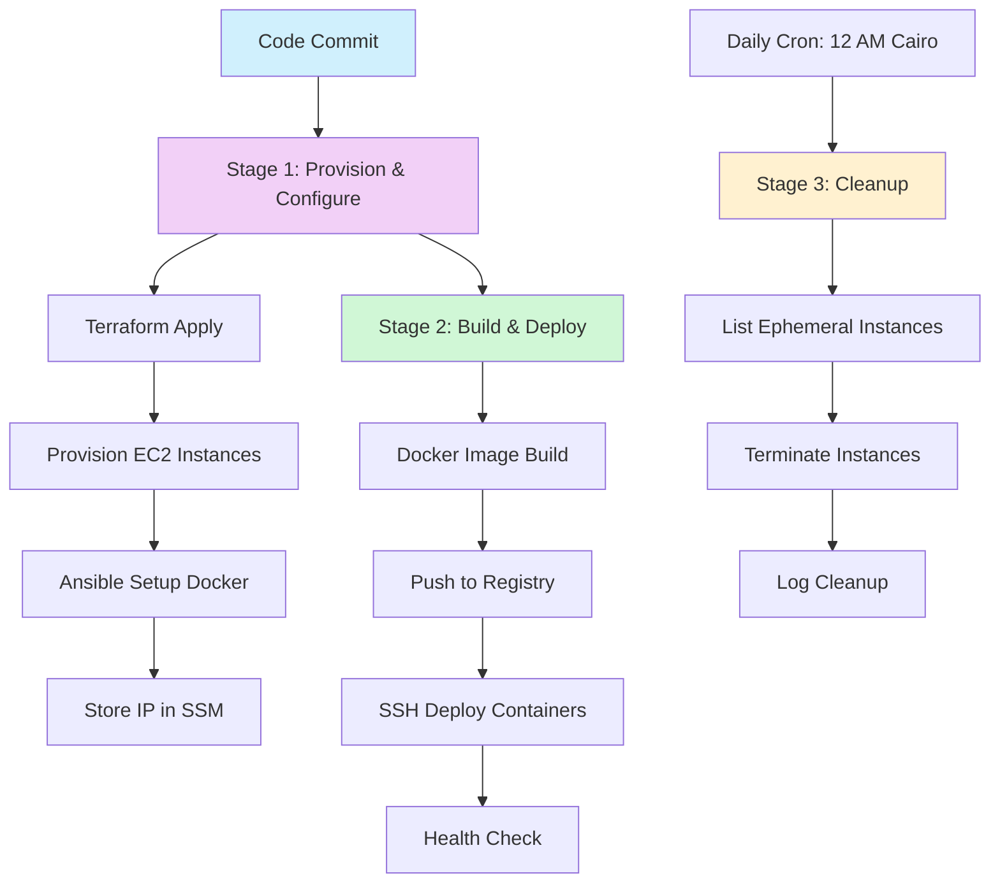

# 🔧 DevOps CI/CD Pipeline: Jenkins | Terraform | Ansible | Docker

[](#pipeline-overview)  
[](#infrastructure)  
[](#configuration)  
[](#containerization)  
[](#automation)  

> **An end-to-end DevOps pipeline showcasing ephemeral AWS instances, automated deployments, and cleanup with best practices in CI/CD.**

---

## Project Summary

This repository demonstrates a **3-stage CI/CD workflow** built for enterprise-level automation:

- **Stage 1:** Provision ephemeral EC2 infrastructure using Terraform  
- **Stage 2:** Configure servers with Ansible, build Docker images, and deploy  
- **Stage 3:** Automatically clean up unused EC2 instances on schedule  

**Why it stands out:**

- Ephemeral infrastructure with automated lifecycle  
- Infrastructure as code with remote Terraform state  
- Repeatable server configuration via Ansible  
- Docker image management with private registry support  
- Jenkins orchestrated pipelines with credential security  
- Scheduled cleanup with audit logs  

---

## Pipeline Overview



---

# 📂 Repository Structure

```
CI-CD-Practical-Task/
├── 📋 Jenkinsfile.provision    # Pipeline 1: Infrastructure provisioning
├── 🚀 Jenkinsfile.deploy       # Pipeline 2: Application deployment  
├── 🧹 Jenkinsfile.cleanup      # Pipeline 3: Automated cleanup
├── 🏗️ terraform/               # Infrastructure as Code
│   ├── main.tf                 # Core infrastructure resources
│   ├── variables.tf            # Configurable parameters
│   ├── outputs.tf              # Resource outputs
│   └── backend.tf              # Remote state configuration
└── ⚙️ ansible/                 # Configuration management
    └── playbook.yml            # Docker installation automation
```

---

# ⚡ Quick Start

### 1. Clone Repository
```bash
git clone <your-repo-url>
cd CI-CD-DevOps
2. Add Jenkins Credentials
aws-creds → AWS Access Key & Secret

docker-hub-creds → Docker Hub credentials

JENKINS_PEM → SSH private key for EC2

JenkinsCleanup → AWS credentials for cleanup jobs

3. Create Jenkins Jobs
Provision → Jenkinsfile.provision

Deploy → Jenkinsfile.deploy

Cleanup → Jenkinsfile.cleanup (schedule: TZ=Africa/Cairo 0 0 * * *)

4. Trigger Pipeline
Push code to the main branch → Pipelines execute automatically

🏗️ Infrastructure (Terraform)
Provision EC2 instances automatically

Manage remote state via S3 + DynamoDB

Tag ephemeral resources for lifecycle management

Store instance metadata in AWS SSM Parameter Store

EC2 Resource Example:

hcl
Copy code
resource "aws_instance" "ci_node" {
  ami                         = data.aws_ami.amazon_linux.id
  instance_type               = var.instance_type
  key_name                    = "Jenkins"
  associate_public_ip_address = true
  tags = {
    Name      = "ci-node"
    lifecycle = "ephemeral"
  }
}
⚙️ Configuration (Ansible)
Install Docker and dependencies

Apply consistent server configuration

Implement security best practices

Playbook Example:

yaml
Copy code
- hosts: all
  become: true
  tasks:
    - name: Install Docker
      apt:
        name: docker.io
        state: present

    - name: Start Docker service
      service:
        name: docker
        state: started
        enabled: true
🐳 Containerization (Docker)
Build Docker images from source code

Push images to a private registry

Deploy containers via SSH to EC2

Dockerfile Example:

dockerfile
Copy code
FROM nginx:alpine
COPY index.html /usr/share/nginx/html/index.html
🤖 Automation (Jenkins)
Stage 1: Provision & configure servers

Stage 2: Build, push, and deploy containers

Stage 3: Cleanup ephemeral resources automatically

Health Check Example:

groovy
Copy code
stage('Health Check') {
    steps {
        sh "curl -f http://$DEPLOYED_INSTANCE || exit 1"
    }
}
🧹 Cleanup
Runs daily at 12:00 AM Cairo timezone

Detects and terminates all ephemeral EC2 instances

Maintains logs for audit and tracking

Cleanup Example:

bash
Copy code
aws ec2 describe-instances \
  --filters "Name=tag:lifecycle,Values=ephemeral" \
            "Name=instance-state-name,Values=pending,running,stopping,stopped" \
  --query "Reservations[].Instances[].InstanceId" \
  --output text | xargs -n 1 aws ec2 terminate-instances --instance-ids
🛡️ Security
No hardcoded secrets; use Jenkins credentials

IAM least privilege for all AWS operations

Encrypted S3 for Terraform state files

Minimal open ports via security groups

VPC isolation & HTTPS communication

📊 Observability
Track Jenkins build status

Monitor EC2 resources

Automatic deployment verification

Audit logs for cleanup operations

Optional Enhancements:

CloudWatch metrics & alarms

Slack notifications

Grafana dashboards

ELK centralized logging

```

---
## 🛠️ Troubleshooting
Terraform state lock: terraform force-unlock <lock-id>

SSH connection issues: Check security groups & instance state

Docker login failure: echo $DOCKER_PASS | docker login -u $DOCKER_USER --password-stdin

Cleanup errors: Terminate manually with aws ec2 terminate-instances --instance-ids <id>

## 🎓 Learning Outcomes
Beginner: CI/CD concepts, automation basics, Docker fundamentals

Intermediate: Terraform patterns, Ansible playbooks, Docker registry management, Jenkins orchestration

Advanced: Enterprise security, scalable architecture, monitoring, blue-green deployments

## 🤝 Contributing
Fork the repository

Create a branch: git checkout -b feature/<feature-name>

Commit changes: git commit -m 'Add feature'

Push branch: git push origin feature/<feature-name>

Open a Pull Request

Guidelines:

Follow existing code style

Add tests for new features

Update documentation

Ensure all pipelines pass
